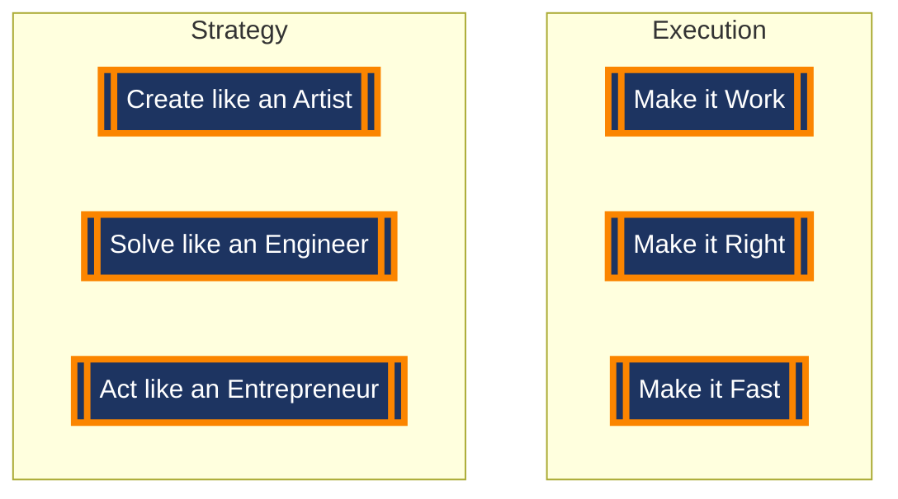

<h1><i>Hi there,  I'm   </i> </h1>
<!-- <h1><i>Hi there,  I'm Dalpat Rathore</i></h1> -->

:computer: I'm a self-taught Software Developer & Designer - focuses on crafting clean, user-friendly UI/UX with responsive web design without sacrificing accessibility, performance, and creativity.
 
🌱Currently, I’m developing, designing, learning, exploring, and thinking about how to make things better.

  

 

<h2>  <i> Projects Developed & Deployed:</i></h2>

<table border="0">
  <tr>
  
   <td align='center' colspan="3">
      <a href="https://dalpatrathore.vercel.app">
          
             <!-- <strong><i>My Portfolio</i></strong> -->
     </a>
   </td>
 </tr>
  <tr>
    
   <td align='left' >
     
  </td> 
   <td align='left'>
     
   </td>
    
   <td align='left'>
         
  </td>    
  </tr>
 
  <tr>

  <td align='left' colspan="3" >
      
        
   </td> 
 
  <!-- <td align='left'>
       
  </td> -->
    
 <!-- <td align='left' >
      
        
   </td> -->
   
 </tr>

</table>
 

<h2><i> Skills Stack & Tech Tools:</i></h2>

 

<h2> <i> GitHub Stats:</i></h2>

<table border="1">
  <tr>
    <td valign="top"><a href="https://github.com/anuraghazra/github-readme-stats"> </td> </a>
    <td valign="top"> <a href="https://github.com/anuraghazra/github-readme-stats"> </td>
    </a>
  </tr>
   <tr>
    <td colspan="2" align="center">   </td> 
    
  </tr>
</table>
 

<h2><i> GitHub Contribution Graph:</i></h2>

<h2><i> Connect With Me:</i></h2>

<table border="1">
  <tr>
    <td>
      <table border="0">
     
 <tr>
  <td>
     ├─◈ <strong>Twitter</strong>:  
    
  </td>
   </tr>
  
  <tr>
  <td>
    ├─◈ <strong>LinkedIn</strong>: 
  </td>
  
   </tr>
  
  <tr>
  <td>
      ├─◈ <strong>Dribble</strong>:  
  </td>
   </tr>

   <tr>
 <td>
   ├─◈ <strong>Dev</strong>:     
  </td>
   </tr> 
<tr>
  <td>
      ├─◈ <strong>Hashnode</strong>:  
  </td>
   </tr>
    
  <tr>
  <td>
      ├─◈ <strong>Medium</strong>:  
  </td>
   </tr>
     
  <tr>
  <td>
      ├─◈ <strong>Portfolio</strong>:  
  </td>
   </tr>
  <tr>
  <td>
      ├─◈ <strong>Resume</strong>:  
  </td>
   </tr>
       
</table>
    </td>
     <td>
    <table>
       
    </table>
       </td>
   </tr>
  </table>
  
<!--  -->
