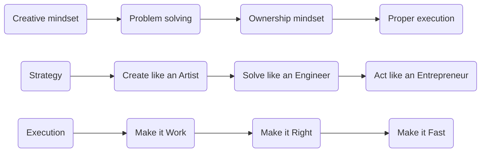

<p align="left">
    <a href="https://dalpatrathore.vercel.app">
      
    </a>
  </p>
<p align="left">  </p>
<h1><i>Hi there, I'm Dalpat Rathore</i></h1>

I'm a **Next.js Fullstack Software Engineer** focused on building fast, scalable, and reliable web applications using modern frameworks and clean architecture.

I enjoy developing fullstack solutions that are user-friendly, accessible, and easy to maintain — from frontend to backend.

Always learning, always building — with a strong attention to detail and a passion for quality.

#### Development Philosophy
```text
1. Performance-First Mindset
2. Clean, Maintainable Code
3. Intuitive UX/UI Patterns
4. Scalable Architecture
5. Continuous Learning & Improvement
```


 

<h2><i> Skills Stack & Dev Tools:</i></h2>

<!-- ─── Front‑End ───────────────────────────────────────────────────────────── -->


<!-- ─── Back‑End & Database ─────────────────────────────────────────────────── -->


<!-- ─── Dev Ops / Utilities ─────────────────────────────────────────────────── -->


<!-- ─── Collaboration & Misc ────────────────────────────────────────────────── -->


<br>

<h2> <i> GitHub Stats:</i></h2>

<table border="1">
  <tr>
    <td valign="top"><a href="https://github.com/anuraghazra/github-readme-stats"> </td> </a>
    <td valign="top"> <a href="https://github.com/anuraghazra/github-readme-stats"> </td>
    </a>
  </tr>
   <tr>
    <td colspan="2" align="center"> <a href="https://git.io/streak-stats">  </a>  </td> 
    
  </tr>
</table>
<br>

<h2><i> GitHub Contribution Graph:</i></h2>

[](https://github.com/ashutosh00710/github-readme-activity-graph)


